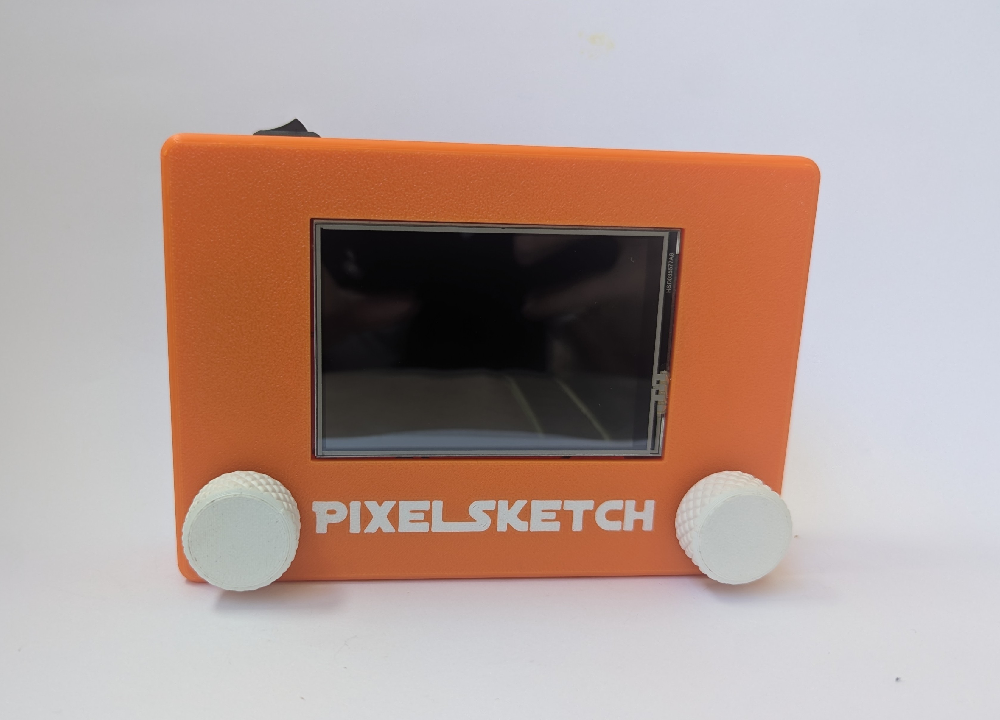
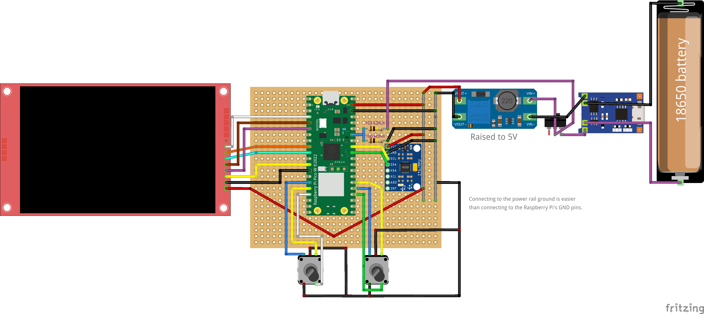

# Digital Etch A Sketch

A digital recreation of the classic Etch A Sketch, built from scratch with a Raspberry Pi Pico.

> 🚧 **Note:** Proper documentation is coming soon! I’ll write it on August 20.

[View the CAD model on Onshape](https://cad.onshape.com/documents/f1feae0bb556c6484e455513/w/0b4a13cc13eba7f4db07bca6/e/b10465846ec39c7c90a8a02b?renderMode=0&uiState=6a84b419d014271cb2e2599e)

Wiring diagram is available in docs folder.

### Features

* 🎨 Color display
* 🎛️ Two rotary encoders for drawing
* 💾 Save drawings
* 🔋 Rechargeable battery
* 🖌️ Adjustable brush size and color
* 📦 Custom 3D-printed enclosure

## Hardware

* **Microcontroller:** Raspberry Pi Pico
* **Display:** MSP3520 3.5" SPI TFT module — ILI9488 driver
* **Rotary encoders:** 2× EC1601J-H01/15
* **Battery:** 18650 Li-ion, 1500 mAh
* **Charging module:** HW-373 (TP4056)
* **Single 18650 battery holder**
* **MPU6050**
* **70 × 90 mm Perfboard**
* **KCD11-101 Power switch**

Built as my first hardware project, using MicroPython.